# ☸️ Kubernetes
**Kubernetes** (também chamado de **k8s**) é uma **plataforma open source** para **orquestração de contêineres**. Ele foi originalmente desenvolvido pelo **Google** e hoje é mantido pela **Cloud Native Computing Foundation (CNCF)**.

Ele ajuda a **implantar**, **escalar** e **gerenciar aplicações em contêineres** (como os criados com Docker) de forma automática e eficiente.

<div align="center">
   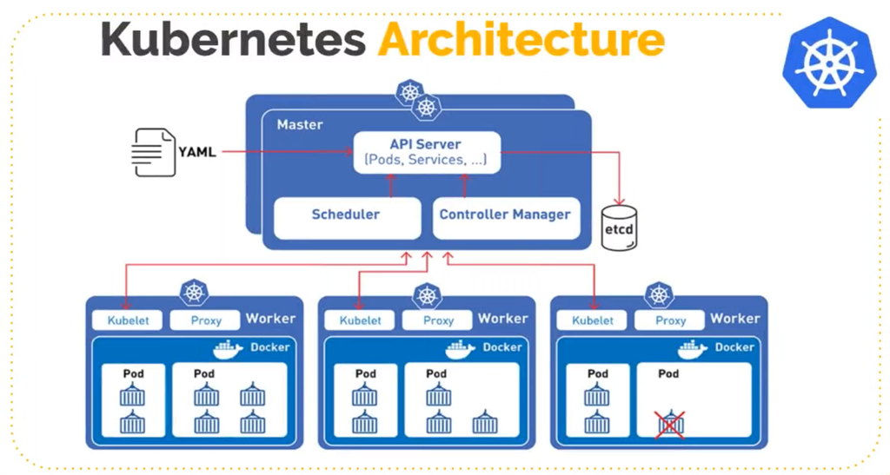
</div>

## 🔧 Funcionalidade Principais
 1. **Orquestra contêineres:** decide onde e como os contêineres devem rodar.
 2. **Implantação automática e rollback:** gerencia a implantação e a atualização dos seus aplicativos sem downtime.
 3. **Escalabilidade automática:** aumenta ou reduz a quantidade de réplicas da aplicação conforme a carga.
 4. **Distribuição de carga:** balanceia o tráfego entre os contêineres.
 5. **Autocorreção:** substitui ou reinicia contêineres com problemas automaticamente.
 
## 📦 Conceitos principais

| Conceito       | Descrição                                                                 |
|----------------|---------------------------------------------------------------------------|
| **Pod**        | Unidade mínima no Kubernetes. Pode conter um ou mais contêineres.         |
| **Node**      | Um servidor (físico ou virtual) que roda os Pods.                         |
| **Cluster**    | Conjunto de Nodes gerenciados pelo Kubernetes.                            |
| **Deployment** | Controla a criação e atualização de Pods.                                 |
| **Service**    | Define como os Pods são acessados na rede (internamente ou externamente). |
| **ConfigMap**  | Armazena configurações não sensíveis que podem ser usadas pelos Pods.     |
| **Secret**     | Armazena dados sensíveis como senhas e tokens de forma segura.            |
| **Ingress**    | Gerencia o tráfego HTTP externo para serviços internos.                   |

## 🚀 Benefícios
 - Alta disponibilidade
 - Escalabilidade horizontal
 - Infraestrutura declarativa (infra como código)
 - Portabilidade entre nuvem e on-premises
 - Automatização de tarefas complexas

## 🔌 Onde o Kubernetes é usado?
 - Hospedagem de microserviços
 - Plataformas SaaS
 - CI/CD pipelines
 - Aplicações que exigem alta disponibilidade e escalabilidade
 - Clouds

---

## 🏗️ Arquitetura
O Kubernetes é um **orquestrador de contêineres de código aberto** que simplifica o complexo processo de gerenciamento de contêineres em escala. Ele abstrai as preocupações com a infraestrutura, permitindo que os desenvolvedores se concentrem na criação de aplicativos em vez de se preocuparem com os servidores subjacentes.

Compreender a arquitetura do Kubernetes é essencial para quem deseja implantar e gerenciar aplicativos escaláveis, resilientes e de nível de produção. 

O diagrama a seguir representa visualmente a arquitetura do Kubernetes:
- Os componentes do plano de controle gerenciam o cluster e garantem que o estado desejado seja mantido.
- Os nós de trabalho executam cargas de trabalho, executando contêineres dentro de pods.
- O API Server atua como ponte entre as interações do usuário (via UI ou CLI) e o cluster.
- Os complementos de rede e armazenamento ampliam os recursos do Kubernetes para ambientes de produção.

<div align="center">
    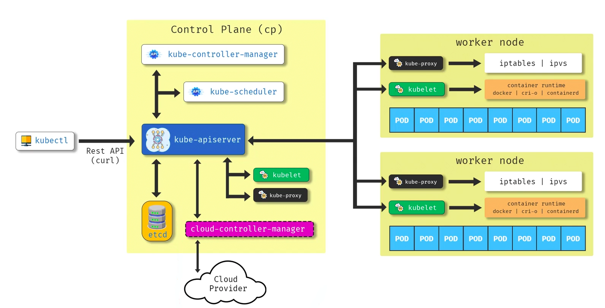
</div>

### 🧩 Componentes Principais

| Componente                   | Descrição                                                                                               |
| ---------------------------- | ------------------------------------------------------------------------------------------------------- |
| **kubectl**                  | CLI usada para interagir com o cluster Kubernetes enviando comandos para o kube-apiserver.              |
| **Cluster**                  | Conjunto completo formado pelo control plane + nodes, onde aplicações são orquestradas pelo Kubernetes. |
| **Control Plane**            | Camada que gerencia o cluster, toma decisões globais e garante o estado desejado do sistema.            |
| **Node**                     | Máquina (VM ou física) onde os containers rodam; contém kubelet, kube-proxy e o container runtime.      |
| **kube-apiserver**           | Porta de entrada do Kubernetes; expõe a API e recebe comandos do kubectl e dos outros componentes.      |
| **kube-controller-manager**  | Conjunto de controladores que mantêm o estado desejado (ReplicationController, NodeController, etc.).   |
| **kube-scheduler**           | Responsável por decidir **em qual node** cada Pod deve rodar com base em recursos e regras.             |
| **cloud-controller-manager** | Integra o Kubernetes com serviços de nuvem (load balancers, volumes, IPs, etc.).                        |
| **etcd**                     | Banco de dados distribuído chave-valor usado pelo Kubernetes para armazenar todo o estado do cluster.   |
| **kubelet**                  | Agente que roda em cada node; garante que os containers definidos no Pod realmente estejam rodando.     |
| **kube-proxy**               | Implementa regras de rede (iptables/IPVS) para serviços e load balancing entre Pods.                    |
| **container-runtime**        | Software que executa containers (como containerd, CRI-O ou Docker em versões antigas).                  |
| **Service**                  | Cria um endereço estável (IP + DNS) e faz balanceamento de carga entre Pods.                            |
| **Pod**                      | A menor unidade executável no Kubernetes; agrupa um ou mais containers que compartilham rede e storage. |

### 🔗 Componentes adicionais importantes

| Componente            | Descrição                                                                                    |
| --------------------- | -------------------------------------------------------------------------------------------- |
| **Deployment**        | Controlador para gerenciar aplicações stateless; controla réplicas, rollout e rollback.      |
| **StatefulSet**       | Controlador para aplicações stateful que precisam de identidade fixa e volumes persistentes. |
| **DaemonSet**         | Garante que um Pod rode em **todos os nodes** (ex.: agentes de monitoramento).               |
| **ReplicaSet**        | Mantém quantidade fixa de Pods rodando; usado internamente pelo Deployment.                  |
| **Namespace**         | Divide o cluster logicamente para isolar ambientes, equipes ou aplicações.                   |
| **ConfigMap**         | Armazena configurações não sensíveis para aplicações.                                        |
| **Secret**            | Armazena dados sensíveis como senhas e chaves, em base64.                                    |
| **Ingress**           | Expõe aplicações HTTP/HTTPS externamente via regras de roteamento.                           |
| **Volume / PVC / PV** | Infraestrutura de armazenamento para persistência de dados.                                  |

#### 🔶 Plano de controle (Control Plane)
O plano de controle do Kubernetes é a camada de gerenciamento central responsável por manter o estado desejado do cluster, agendar cargas de trabalho e lidar com a automação. Ele garante que os aplicativos sejam executados conforme o esperado, monitorando continuamente as condições do cluster e fazendo os ajustes necessários.
<div align="center">
   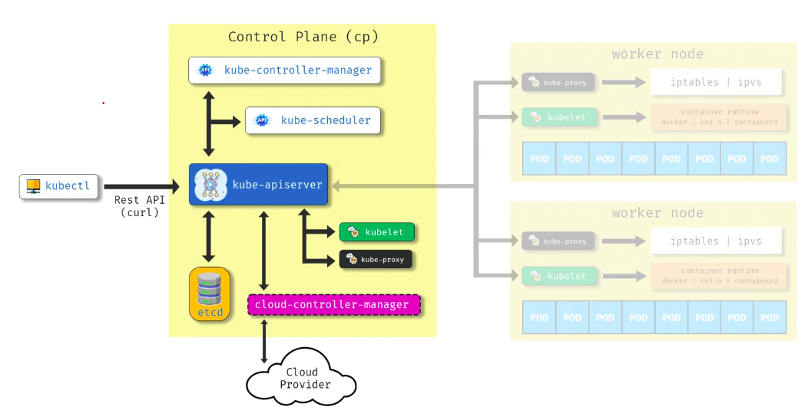
</div>

#### 🔶 Servidor de API (kube-apiserver)
O servidor de API é o gateway para o cluster do Kubernetes. Ele processa todas as solicitações de gerenciamento, seja da CLI (kubectl), de painéis da interface do usuário ou de ferramentas de automação. Sem um API Server em execução, o cluster permanece funcional, mas os administradores perdem o controle direto sobre as implementações e configurações.

<div align="center">
   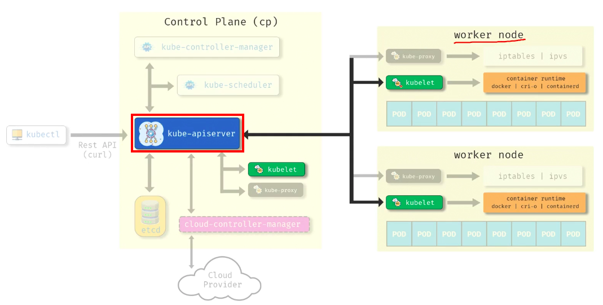
</div>

**🔹 Subindo Swagger do API-SERVER:**
```bash
# Iniciando minikube
minikube start -n 2 -p multinode

# Baixando json das APIs
kubectl get --raw /openapi/v2 > k8s.json

# Subindo container do swagger
docker run -v $PWD/k8s.json:/app/swagger.json -p 4500:8080 swaggerapi/swagger-ui
```

#### 🔶 Gerenciador de controlador (kube-controller-manager)

O Kubernetes opera no padrão de controlador, em que os controladores monitoram o estado do sistema e tomam ações corretivas. O gerente de controladoria supervisiona esses controladores, garantindo funções essenciais como:

- Dimensionamento de cargas de trabalho com base na demanda.
- Gerenciar nós com falha e reprogramar cargas de trabalho.
- Impor os estados desejados (por exemplo, garantir que uma implantação sempre execute o número especificado de réplicas).

<div align="center">
   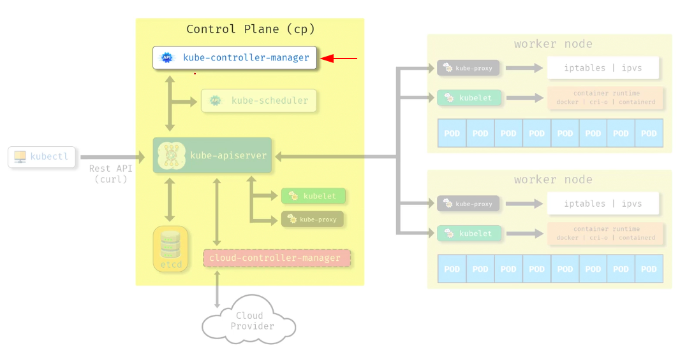
</div>

#### 🔶 Agendador (kube-scheduler)

O Agendador atribui Pods a nós de trabalho, considerando fatores como:

- Disponibilidade de recursos (CPU, memória).
- Regras de afinidade e antiafinidade de nós.
- Distribuição de pods para evitar sobrecarga.

Ele segue um processo de filtragem e pontuação para selecionar o nó ideal para cada novo pod, garantindo a utilização equilibrada dos recursos.

#### 🔶 etcd (armazenamento distribuído de chave-valor)

O etcd funciona como a única fonte de verdade do Kubernetes, armazenando todos os dados do cluster, incluindo:

- O banco de dados do k8s
- Chave/Valor
- Definições de configuração.
- Segredos e credenciais.
- Estados atuais e históricos das cargas de trabalho.

Como o comprometimento do etcd concede controle total sobre o cluster, ele deve ser protegido e receber recursos de hardware adequados para manter o desempenho e a confiabilidade.

<div align="center">
   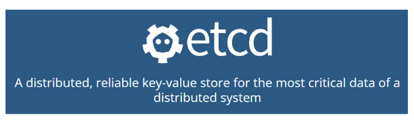
</div>

#### 🔶 Gerenciador de controlador de nuvem (cloud-controller-manager)

Para implantações do Kubernetes baseadas na nuvem, o Cloud Controller Manager integra o cluster com os serviços do provedor de nuvem, manipulando-os:

- Provisionamento de balanceadores de carga.
- Alocação de volumes de armazenamento persistente.
- Dimensionar a infraestrutura dinamicamente (por exemplo, adicionar máquinas virtuais como nós)

### 🧩 Componentes do Nó (Worker Node)

Os Worker Nodes são a espinha dorsal computacional de um cluster do Kubernetes, responsáveis por executar cargas de trabalho de aplicativos. Cada nó opera de forma independente e, ao mesmo tempo, mantém comunicação constante com o plano de controle para garantir uma orquestração tranquila.

O Kubernetes programa dinamicamente os pods em nós de trabalho com base na disponibilidade de recursos e nas demandas de carga de trabalho. Os nós podem ser máquinas físicas ou virtuais, e um cluster pronto para produção geralmente consiste em vários nós para permitir o dimensionamento horizontal e a alta disponibilidade. Cada nó de trabalho inclui os seguintes componentes essenciais:

<div align="center">
   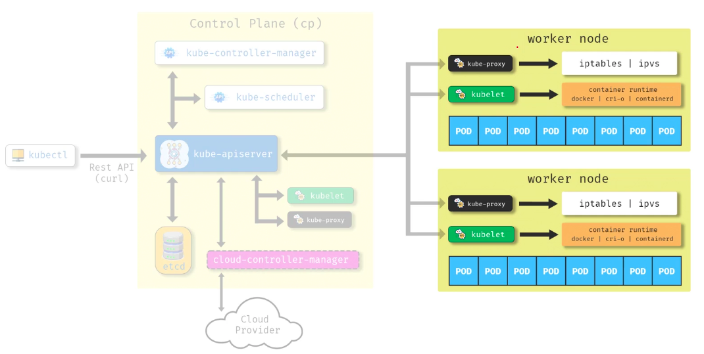
</div>

#### 🔶 O agente do Nó (kubelet)

O Kubelet é o principal agente em nível de nó que gerencia a execução de contêineres.

- Comunica-se continuamente com o API Server para receber - instruções.
- Garante que os pods sejam executados conforme definido em suas especificações.
- Extrai imagens de contêineres e inicia os contêineres necessários.
- Monitora a integridade dos contêineres e os reinicia, se necessário.

Sem o Kubelet, o nó seria desconectado do cluster, e as cargas de trabalho programadas não seriam gerenciadas adequadamente.

<div align="center">
   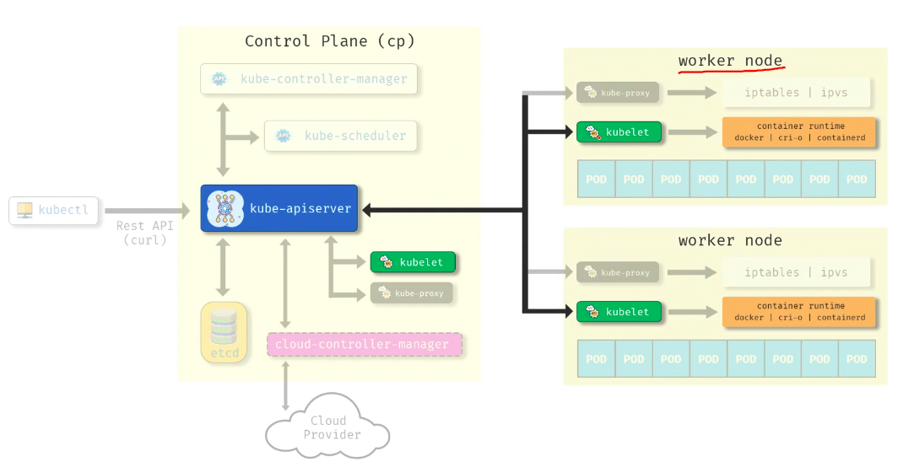
</div>

#### 🔶 Rede e Balanceamento de Carga (kube-proxy)

O Kube-Proxy é responsável por gerenciar a comunicação de rede entre os serviços executados em nós diferentes.

- Configura as regras de rede para permitir uma comunicação perfeita entre os pods.
- Facilita a descoberta de serviços e o balanceamento de carga para redes entre pods.
- Garante que o tráfego seja roteado corretamente entre os nós e os clientes externos.

Se o Kube-Proxy falhar, os pods no nó afetado poderão ficar inacessíveis, interrompendo o tráfego de rede dentro do cluster.

<div align="center">
   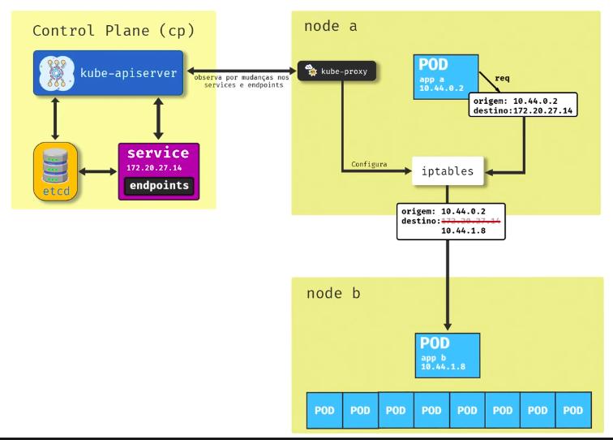
</div>

#### 🔶 Executando contêineres (container-runtime)

O contêiner runtime é o software que executa aplicativos em contêineres dentro dos pods. O Kubernetes oferece suporte a várias opções de tempo de execução, incluindo:

- containerd (mais comumente usado)
- CRI-O (leve e nativo do Kubernetes)
- Mecanismo Docker (suporte legado via dockershim)

O tempo de execução interage com o sistema operacional para isolar as cargas de trabalho usando tecnologias como cgroups e namespaces, garantindo a utilização eficiente dos recursos.

#### 🔶 Pod

- Menor unidade do kubernetes
- Um ou mais containers
- Containers dentro de um POD podem se comunicar através:
  - Inter-process communication (IPC)
  - Loopback interfafce (localhost)
  - Shared VOlume
- **"one-container-per-pod"** é o modelo mais comum

<div align="center">
   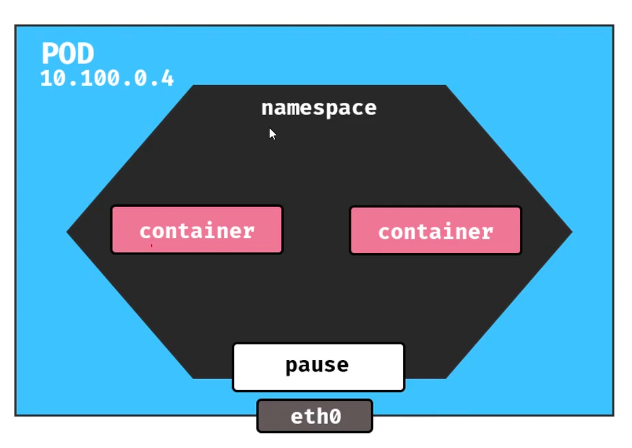
</div>

- Um ip por POD
   - Atualmente a HPE Labs poossui um plugin para mais de um ip po pod. Mas outras iniciativas no passado não tiveram sucesso
- Sidecar: Um container para executar uma tarefa auxiliar

<div align="center">
   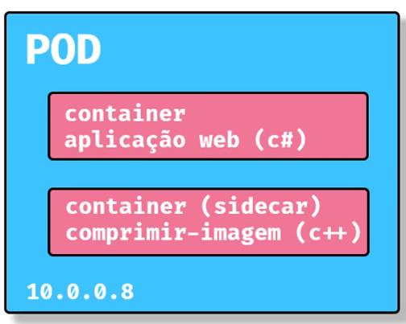
</div>

- **Ciclo de Vida**
<div align="center">
   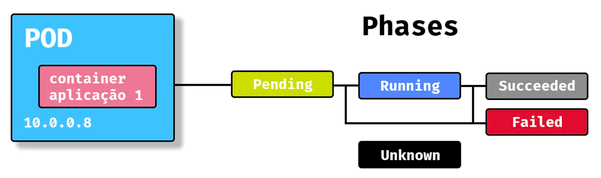
</div>

- **Estados do Container**
<div align="center">
   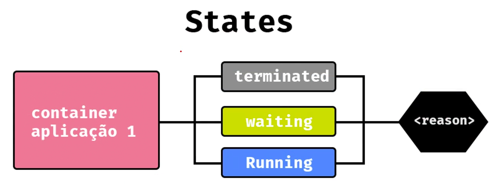
</div>

#### 🔶 Namespace
O objetivo do Namespace é organizar, isolar e gerenciar recursos dentro de um mesmo cluster.
Ele funciona como “gavetas” lógicas dentro do cluster.

- **1. Isolamento lógico entre equipes, ambientes ou aplicações**
   - Separar dev, homolog, prod dentro do mesmo cluster.
   - Cada time pode ter seu espaço sem interferir no outro.

- **2. Evitar conflitos de nomes**
   - Dois pods, services ou deployments podem ter o mesmo nome, desde que estejam em namespaces diferentes.

- **3. Aplicar políticas de segurança (RBAC) com escopo**

   **Permite definir:**
   - quem pode acessar
   - o que pode acessar em cada namespace.

   **Exemplo:** Time A só pode mexer no namespace payments.

- **4. Controlar consumo de recursos (limites e quotas)**

   Você pode limitar CPU, memória ou número de pods por namespace.

   **Exemplo:**
   - dev → 2 CPUs
   - prod → 20 CPUs

- **5. Organização dos recursos**

   - Facilita listar, monitorar e administrar recursos agrupados.

- **6. Segmentar workloads em clusters compartilhados**

   - Permite vários produtos, times ou microservices rodarem no mesmo cluster sem bagunça.

<div align="center">
   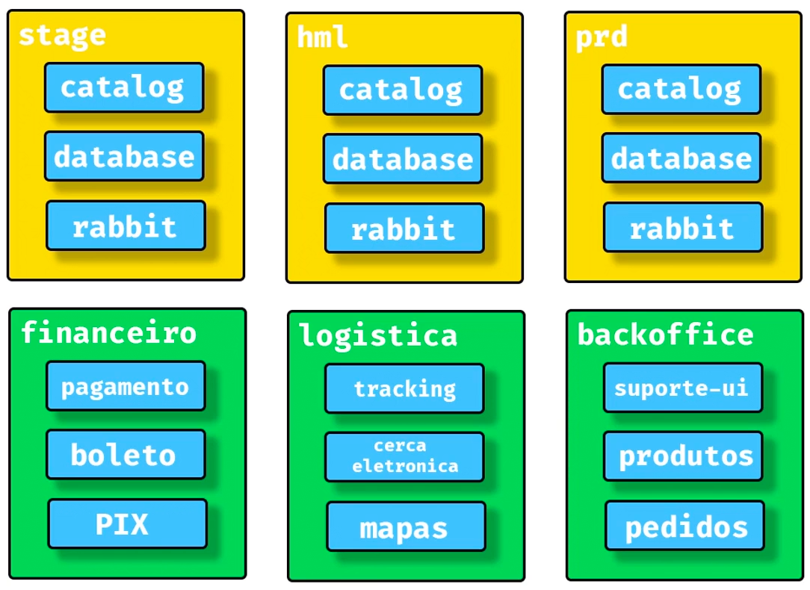
</div>

#### 🔶 Services

Um Service é um objeto que expõe e estabiliza o acesso a um conjunto de Pods, funcionando como uma camada de rede fixa, mesmo quando os Pods sobem ou caem.

<div align="center">
   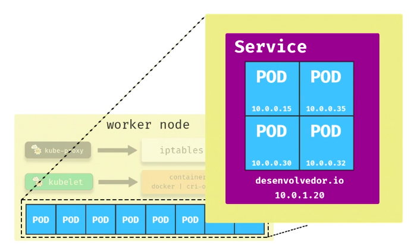
</div>

<div align="center">
   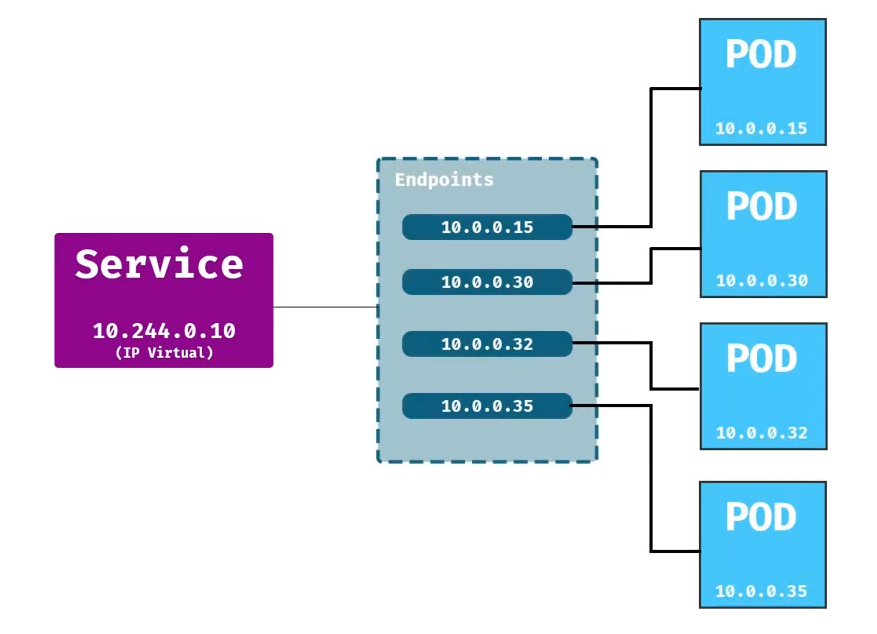
</div>

##### 📌 Em resumo, um Service serve para:

- Dar um IP fixo e um DNS estável para acessar Pods.
- Balancear carga automaticamente entre múltiplos Pods.
- Encapsular a lógica de descoberta de Pods, usando labels e selectors.

##### 🧩 Tipos principais de Service:

- **ClusterIP (padrão) →** acessível apenas dentro do cluster.
- **NodePort →** abre uma porta em todos os nodes para acesso externo.
- **LoadBalancer →** cria um load balancer externo (em nuvens públicas).
- **ExternalName →** mapeia para um DNS externo.

#### 🔶 Como os nós de trabalho interagem com o plano de controle

- Os nós entram no cluster usando um token emitido pelo plano de controle.
- Depois que um nó é registrado, o agendador atribui cargas de trabalho com base nos recursos disponíveis.
- O plano de controle monitora continuamente a integridade do nó e pode reprogramar as cargas de trabalho se um nó ficar insalubre ou sobrecarregado.

Ao combinar o Kubelet, o Kube-Proxy e um tempo de execução de contêiner, os nós de trabalho formam uma camada de execução dimensionável e resiliente que alimenta os aplicativos Kubernetes.

### 🖧 Ingress

O **Ingress** é um recurso que controla como o tráfego externo (HTTP/HTTPS) chega aos serviços dentro do cluster. Ele funciona como uma camada de roteamento, atuando como um gateway de entrada mais inteligente e flexível do que um simples `NodePort` ou `LoadBalancer`.

<div align="center">
   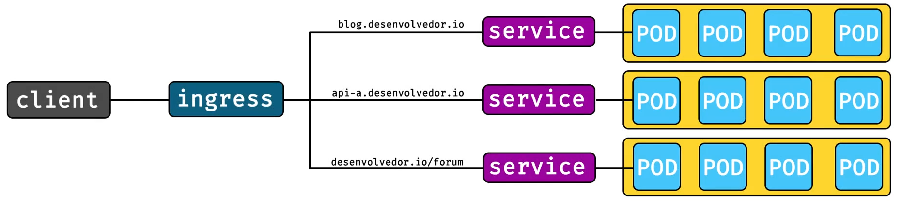
</div>

#### 🛣️ O que é o Ingress?

**O Ingress é:**

- Um objeto de configuração com regras de roteamento.
- Associado a um Ingress Controller (como NGINX, Traefik, Istio Gateway).
- Usado para expor serviços HTTP/HTTPS dentro do cluster para o mundo externo.

**Ele permite:**

- Roteamento por URL (path-based)
- Roteamento por domínio (host-based)
- TLS/HTTPS com certificados
- Balanceamento de carga
- Reescrita de paths
- Rate limiting, auth, caching (dependendo do controller)

#### 🔁 Como funciona o fluxo

```css
[Cliente] -> [Load Balancer / NodePort] -> [Ingress Controller] -> [Service] -> [Pod]
```

1. O usuário acessa um domínio (ex: api.meusite.com).
1. Esse tráfego chega ao Ingress Controller.
1. O controller consulta as regras do Ingress.
1. Roteia para o Service correto.
1. O Service envia para os pods.

#### 📝 Exemplo básico de Ingress

##### ✔ Roteando domínio para um serviço

```yaml
apiVersion: networking.k8s.io/v1
kind: Ingress
metadata:
  name: meu-ingress
spec:
  rules:
  - host: api.meusite.com
    http:
      paths:
      - path: /
        pathType: Prefix
        backend:
          service:
            name: meu-service
            port:
              number: 80
```

##### ➗ Roteamento por path

Exemplo com APIs diferentes:

```yaml
rules:
- host: app.meu.com
  http:
    paths:
    - path: /api
      pathType: Prefix
      backend:
        service:
          name: api-service
          port:
            number: 80
    - path: /web
      pathType: Prefix
      backend:
        service:
          name: web-service
          port:
            number: 80
```

##### 🔐 HTTPS com TLS

Ingress com certificado TLS:

```yaml
spec:
  tls:
  - hosts:
    - app.meu.com
    secretName: certificado-tls
  rules:
  - host: app.meu.com
    http:
      paths:
      - path: /
        pathType: Prefix
        backend:
          service:
            name: web
            port:
              number: 80
```
O certificado precisa estar em um **Secret do tipo tls**.

#### 🆚 Ingress vs LoadBalancer vs NodePort

**NodePort**
- expõe um serviço via porta de cada nó
- simples e limitado
- não suporta múltiplos domínios/paths

**LoadBalancer**
- cria um load balancer externo (cloud)
- caro se tiver muitos serviços
- apenas 1 serviço por LB

**Ingress ⭐**

- 1 load balancer → múltiplos serviços
- suporte a múltiplos hosts
- roteamento avançado
- TLS centralizado

Ingress é a solução correta para aplicações web.

#### 🧠 Quando usar Ingress?

✔ Você tem vários serviços HTTP/HTTPS

✔ Quer expor APIs com diferentes domínios ou paths

✔ Precisa de HTTPS/TLS

✔ Quer economizar usando 1 LoadBalancer só

✔ Precisa de roteamento avançado

#### ⚠ Quando não usar Ingress

✖ Serviços TCP/UDP (a não ser que o controller suporte)

✖ Aplicações que não falam HTTP/HTTPS

✖ Cenários ultra simples (usando apenas NodePort)

✖ Quando seu service é interno (use ClusterIP)

---

## 🌐 Network
A rede no Kubernetes (K8s) segue alguns princípios fundamentais para garantir que todos os componentes, Pods, Nodes, Services possam se comunicar de forma previsível, independente de onde estão no cluster.

<div align="center">
   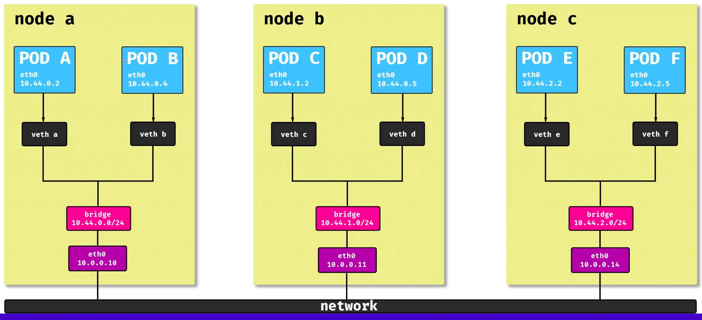
</div>

A arquitetura de rede no Kubernetes é baseada em **quatro garantias principais**:

### 📌 1. Cada Pod recebe um IP próprio

- Cada Pod ganha seu próprio endereço IP único, que não é compartilhado com outros Pods.
- Isso permite que os Pods se comuniquem de forma direta, usando portas simples, sem NAT dentro do cluster.
- Os containers dentro do mesmo Pod compartilham o mesmo namespace de rede (mesmo IP, mesmas portas).

### 📌 2. Comunicação Pod → Pod deve ser livre (sem NAT)

Kubernetes define que:

- Todos os Pods devem poder se comunicar entre si independentemente do Node onde estão.
- Essa comunicação deve ocorrer sem NAT (Network Address Translation).

É por isso que o Kubernetes exige um CNI plugin (Container Network Interface), como:

- Calico
- Flannel
- Cilium
- Weave Net
- Amazon VPC CNI
- Azure CNI
- GKE Dataplane V2

Esses plugins são responsáveis por:

- Criar rotas entre Pods
- Atribuir IPs
- Configurar iptables/ebpf
- Implementar políticas de rede (network policies)

### 📌 3. Comunicação Pod → Service

Um Service representa um endpoint estável (IP fixo) que distribui tráfego para Pods.

Existem tipos diferentes de serviços:

#### 🟦 ClusterIP

- Padrão
- Acessível somente dentro do cluster

#### 🟧 NodePort

- Abre uma porta em todos os nodes
- Encaminha tráfego externo para o Service

<div align="center">
   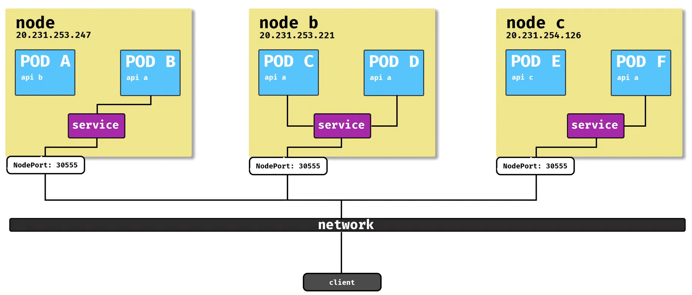
</div>

#### 🟥 LoadBalancer

- Integrado com a nuvem (AWS, Azure, GCP etc.)
- Cria um Load Balancer externo

**Como funciona internamente?**
O kube-proxy cria regras usando:

- iptables, ou
- ipvs

Essas regras equilibram o tráfego entre os Pods selecionados.

<div align="center">
   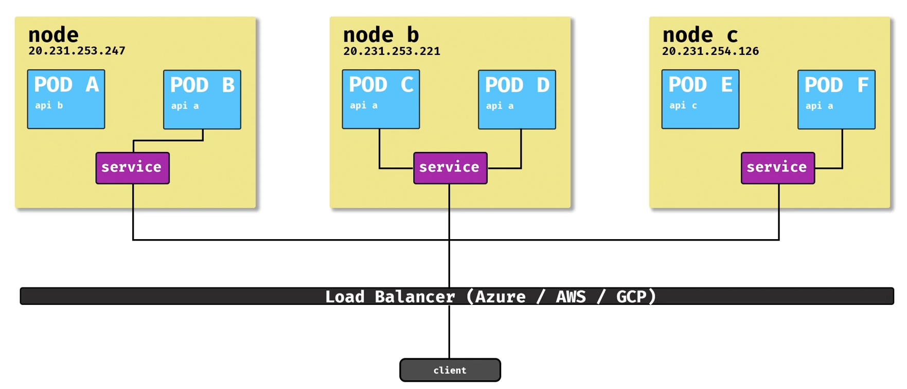
</div>

### 📌 4. Comunicação com o mundo externo

Há dois caminhos principais:

#### 🔹 Entrada no cluster (Ingress)

Ingress + Ingress Controller (NGINX, Traefik, Istio, etc.)
→ Recebe tráfego HTTP/HTTPS e roteia para Services.

#### 🔹 Saída do cluster (Egress)

Normalmente via:

- NAT do Node
- Regras de Egress
- Gateways (Istio, Cilium eBPF etc.)

### 🧩 Componentes importantes da rede no K8s

#### ✔ CNI Plugin (obrigatório)
Responsável pelo plano de dados da rede:

- Configura interfaces & rotas
- Gerencia endereços IP
- Implementa network policies

Sem um CNI, Pods não sobem.

<div align="center">
   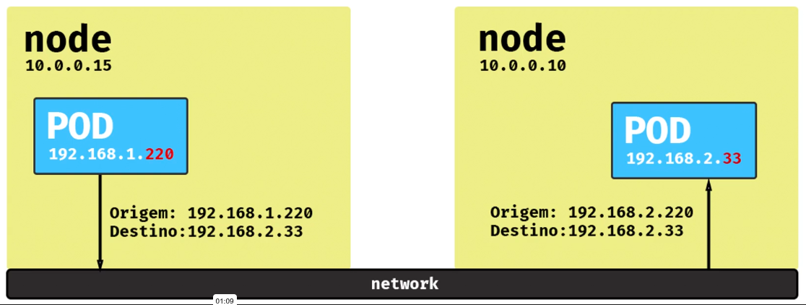
</div>

#### ✔ kube-proxy

Implementa o serviço de rede:

- Regras de load balancing
- Regras de Service → Pod
- Usa iptables ou IPVS

#### ✔ CoreDNS
- **Resolve nomes internos como:** myservice.default.svc.cluster.local
- Traduz para o ClusterIP do Service.

#### 📝 Em poucas palavras:

- Cada Pod tem seu próprio IP.
- Plugins CNI criam a malha de rede.
- kube-proxy controla o roteamento para Services.
- Ingress controla entrada.
- NAT ocorre apenas na borda (entrada/saída), não entre Pods.

---

## ❤️‍🩹 Self-Healing 

### 🕵️ Probes - Nível de Containers

As probes no Kubernetes são verificações de saúde que o kubelet faz periodicamente dentro dos containers. Elas ajudam o cluster a tomar decisões automáticas sobre reiniciar containers, colocá-los ou não no tráfego e garantir que a aplicação está realmente funcionando.

**Existem três tipos principais:**

#### 🧪 1. Liveness Probe
##### 📌 Para que serve

- Detecta se o container está vivo e funcionando corretamente.
- Se a probe falhar, o kubelet reinicia o container.

##### 🧠 Quando usar

- Sua aplicação pode travar, deadlockar ou ficar em loop infinito.
- Há situações em que um restart limpa o problema.

#### 🟢 2. Readiness Probe
##### 📌 Para que serve

- Indica se o container está pronto para receber tráfego.
- Se falhar, o Pod continua rodando, mas:
   - é removido do Service Endpoints
   - não recebe requisições

##### 🧠 Quando usar

- Verificar dependências
- A aplicação depende de banco de dados, filas ou cache externos.

#### 🚀 3. Startup Probe
##### 📌 Para que serve

- Evita que o kubelet mate containers que demoram para iniciar.
- Enquanto a startup probe não for bem-sucedida, liveness e readiness ficam desativadas.

##### 🧠 Quando usar

- Aplicações que levam muito tempo para iniciar (Spring Boot, .NET, migrações, etc.)
- Workloads com inicialização imprevisível.

#### 🔍 Tipos de Probes (formas de checagem)

As probes podem ser feitas de 3 maneiras:

##### ✔️ HTTP

Kubernetes faz um GET e espera um código 2xx ou 3xx.

```yaml
httpGet:
  path: /health
  port: 8080
```

##### ✔️ TCP

Kubernetes tenta abrir uma conexão TCP.

```yaml
tcpSocket:
  port: 8080
```

##### ✔️ Exec

Executa um comando dentro do container.

```yaml
exec:
  command: ["pg_isready", "-U", "postgres"]
```

#### 📊 Parâmetros importantes
| Parâmetro             | Significado                                 |
| --------------------- | ------------------------------------------- |
| `initialDelaySeconds` | Espera antes da primeira checagem           |
| `periodSeconds`       | Intervalo entre checagens                   |
| `timeoutSeconds`      | Timeout da checagem                         |
| `failureThreshold`    | Quantos erros antes de considerar falha     |
| `successThreshold`    | Quantos sucessos para considerar recuperado |

#### 🎯 Resumo Final

- Liveness → reinicia containers travados, **utilizado para verificar o próprio serviço**
- Readiness → controla entrada de tráfego, **utilizado para verificar o serviços dependententes**
- Startup → protege aplicações com startup lenta, **utilizado para aplicações que demoram para iniciar**
- HTTP/TCP/Exec → mecanismos de teste
- Parametrização fina → evita falsos positivos e interrupções

### 🔁 ReplicationControler - Nivel de Pod

O ReplicationController (RC) é um dos primeiros mecanismos de replicação e alta disponibilidade do Kubernetes. Ele garante que sempre exista um número desejado de Pods rodando, recriando Pods que falham, são deletados ou morrem por qualquer motivo.

Embora hoje ele tenha sido substituído na prática pelo ReplicaSet e Deployment, ainda é importante entender seu funcionamento.

**1. POD A Funcionando**
<div align="center">
   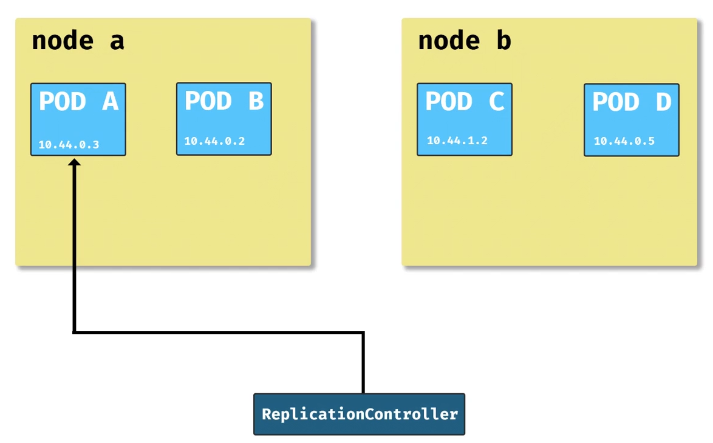
</div>

**2. POD A Parou de funcionar**
<div align="center">
   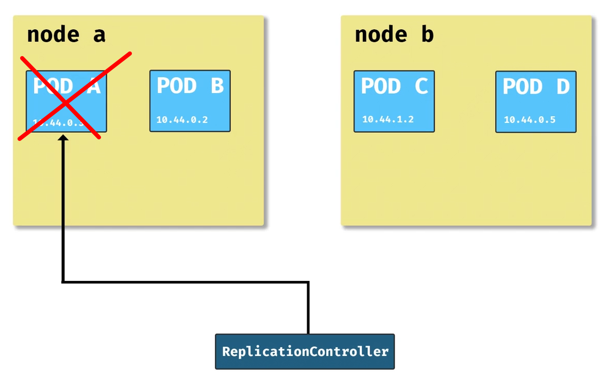
</div>

**3. RC replica para outro Node**
<div align="center">
   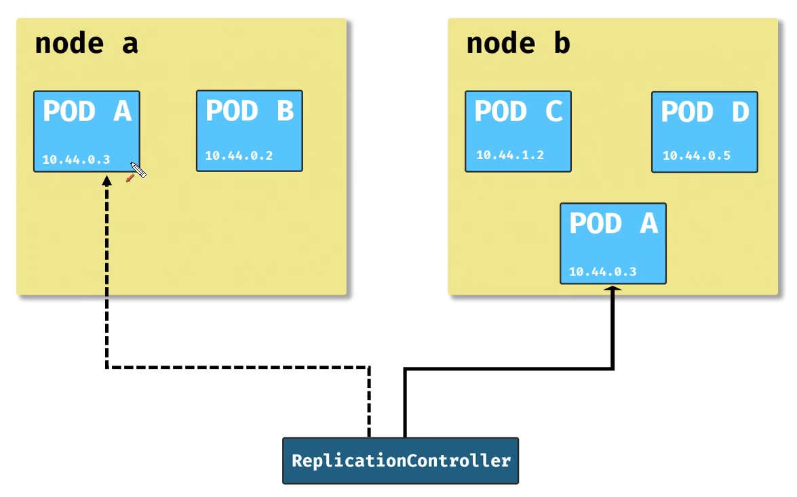
</div>

#### 🔧 O que é o Replication Controller

O **ReplicationController** é um objeto do Kubernetes que:

1. Mantém um número fixo de réplicas de um Pod.
2. Cria novos Pods quando o número atual é menor que o desejado.
3. Remove Pods excedentes se houver mais do que o especificado.
4. Faz self-healing quando Pods são deletados ou morrem.

#### ⚙️ Como ele funciona

Ele monitora continuamente dois estados:
- Estado desejado: definido no spec (replicas, template, selector)
- Estado atual: quantos Pods existem realmente

Se houver diferença, o RC ajusta automaticamente:
| Situação                  | Ação do RC      |
| ------------------------- | --------------- |
| Número de Pods < desejado | cria novos Pods |
| Número de Pods > desejado | deleta Pods     |
| Pod falhou                | cria novo Pod   |
| Pod deletado              | recria          |

#### 🧱 Estrutura básica de um Replication Controller
```yaml
apiVersion: v1
kind: ReplicationController
metadata:
  name: my-app
spec:
  replicas: 3
  selector:
    app: my-app
  template:
    metadata:
      labels:
        app: my-app
    spec:
      containers:
      - name: app
        image: nginx
```

**Campos importantes:**
- replicas → quantidade desejada
- selector → regras que definem quais Pods o RC controla
- template → o “molde” para criar novos Pods

#### 🆚 Replication Controller vs ReplicaSet

Embora ambos façam praticamente a mesma coisa, há diferenças importantes:

##### ✔️ ReplicaSet (RS)

- é a versão mais moderna
- usa selectors mais avançados (matchExpressions)
- é a base do Deployment

##### ✔️ Replication Controller (RC)

- mais antigo (legado)
- usa apenas selectors simples (matchLabels)
- não suporta rollouts e rollbacks nativamente

Por isso, **na prática quase ninguém usa RC hoje**.

**O fluxo moderno é:**

👉 Deployment → ReplicaSet → Pods

### 📈 DeamonSet
O **DaemonSet** é um tipo de **controller** que garante que uma **cópia de um Pod seja executada em todos ou em um subconjunto de nós** do cluster.

<div align="center">
   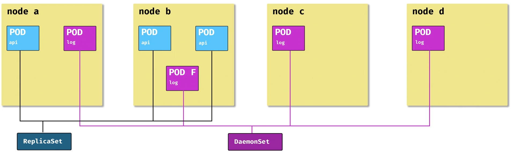
</div>

#### 🔷 Quando usar o DaemonSet?

Ele é útil quando você precisa garantir que um Pod seja executado em todos os nós ou em um conjunto específico de nós. Alguns exemplos de uso incluem:

- **Monitoramento:** DaemonSets são frequentemente usados para rodar agentes de monitoramento (ex: Prometheus, Fluentd, Elastic Agent) em todos os nós.
- **Log Aggregation:** Implementar agentes de coleta de logs (ex: fluentd, logstash) que precisam rodar em cada nó do cluster.
- **Networking:** Para implementar soluções de rede, como CNI (Container Network Interface).
Storage: Para rodar agentes que gerenciam volumes distribuídos, como Ceph ou GlusterFS.

#### 🔷  Características principais do DaemonSet

- **Escalabilidade automática:** Quando você adiciona um novo nó ao cluster, o DaemonSet cria automaticamente um Pod nesse nó.
-- **Controle de afinidade de nó:** Você pode especificar que o DaemonSet deve rodar apenas em nós específicos (ex: apenas em nós com uma determinada label).
- **Rolling Updates:** O DaemonSet suporta atualizações contínuas (rolling updates) para garantir que seus Pods sejam atualizados sem causar downtime.

#### 🔷 Diferença entre DaemonSet e ReplicaSet

- DaemonSet garante que um **Pod por nó** seja executado.
- ReplicaSet garante que **um número fixo de Pods** esteja disponível, mas sem a preocupação de em quais nós eles serão executados.

#### 🎯 Resumo

- **DaemonSet** é utilizado para garantir que um Pod seja executado em todos os nós ou subconjunto de nós do cluster.
- É comum em cenários como **monitoramento**, **log aggregation**, **networking**, e **storage**.
- Ele cuida da criação e exclusão de Pods automaticamente conforme nós são adicionados ou removidos.

### ⏳ Jobs

**Job** é um tipo de recurso usado para executar tarefas pontuais, diferente de Deployments, que mantêm pods rodando continuamente.
Um **Job garante que uma ou mais execuções de um Pod** sejam concluídas com sucesso, respeitando critérios configuráveis.

A seguir, um resumo claro e completo:

#### ✅ O que é um Job no Kubernetes?

Um **Job** cria Pods para realizar uma tarefa que termina (não é contínua).
Ele monitora esses pods e garante que um número especificado de execuções termine com sucesso.

**É ideal para:**
- Importação de dados
- Exportação de dados
- Processamentos batch
- Execuções únicas
- Migrações de banco
- Envio de e-mails em lote
- Scripts de manutenção
- Geração de relatórios

#### 🧩 Como funciona

**Quando você cria um Job:**

1. O Kubernetes cria um Pod (ou vários).
1. Ele roda até sair com código 0 (sucesso).
1. Se falhar, o Job pode recriar o Pod dependendo da política de restart.
1. Quando o número de execuções bem-sucedidas iguala o esperado, o Job termina.

#### 🔄 Tipos de Jobs
🗘 **1. Job simples (execução única)**

Roda um pod até terminar com sucesso.

```yaml
apiVersion: batch/v1
kind: Job
metadata:
  name: exemplo-job
spec:
  template:
    spec:
      containers:
        - name: hello
          image: busybox
          command: ["echo", "Hello Job!"]
      restartPolicy: Never
```

🗘 **2. Job com paralelismo (batch paralelo)**

Executa várias tarefas simultaneamente.

Parâmetros importantes:

- **parallelism:** quantos pods rodam ao mesmo tempo
- **completions:** quantas execuções totais são necessárias

```yaml
spec:
  parallelism: 3
  completions: 10
```

**Isso significa:**
- 3 pods ao mesmo tempo
- até completar 10 execuções bem-sucedidas

🗘 **3. CronJob (agendado)**

É como um cron Linux, roda Jobs em horários definidos.

```yaml
apiVersion: batch/v1
kind: CronJob
metadata:
  name: exemplo-cron
spec:
  schedule: "0 * * * *" # a cada 1h
  jobTemplate:
    spec:
      template:
        spec:
          containers:
            - name: task
              image: busybox
              command: ["echo", "Executando tarefa agendada"]
          restartPolicy: Never
```

#### 🔐 Políticas importantes
🔹 **restartPolicy**

Para Jobs, geralmente:

- `Never`
- `OnFailure`

🔹 **backoffLimit**

Quantas vezes o K8s tenta recriar o pod antes de declarar falha.

```yaml
spec:
  backoffLimit: 4
```

🔹 **activeDeadlineSeconds**

Tempo máximo permitido para a conclusão.

🔹 **ttlSecondsAfterFinished**

Apaga Jobs automaticamente após finalizados.

---

## 🌩️ Principais provedores e suas implementações Kubernetes
| Provedor                        | Nome do Serviço Kubernetes                     | Sigla     |
| ------------------------------- | ---------------------------------------------- | --------- |
| **Amazon Web Services (AWS)**   | Elastic Kubernetes Service                     | **EKS**   |
| **Microsoft Azure**             | Azure Kubernetes Service                       | **AKS**   |
| **Google Cloud Platform (GCP)** | Google Kubernetes Engine                       | **GKE**   |
| **IBM Cloud**                   | IBM Kubernetes Service                         | **IKS**   |
| **Oracle Cloud**                | Oracle Container Engine for Kubernetes         | **OKE**   |
| **Alibaba Cloud**               | Alibaba Cloud Container Service for Kubernetes | **ACK**   |
| **DigitalOcean**                | DigitalOcean Kubernetes                        | **DOKS**  |
| **Linode (Akamai Cloud)**       | Linode Kubernetes Engine                       | **LKE**   |

---

## ▶️ Comandos Essenciais

### ☸️ 0. Minikube
| Ação                            | Comando                             |
| ------------------------------- | ----------------------------------- |
| Iniciar minikube                | `minikube start -n 2 -p multinode`  |
| Parar minikube                  | `minikube stop -p multinode`        |

### 🔍 1. Inspeção de recursos
| Ação                            | Comando                         |
| ------------------------------- | ------------------------------- |
| Listar pods                     | `kubectl get pods`              |
| Listar pods com detalhes        | `kubectl get pods -o wide`      |
| Listar ANY resource             | `kubectl get <resource>`        |
| Ver YAML completo de um recurso | `kubectl get pod <pod> -o yaml` |
| Ver alterações em tempo real    | `kubectl get pods -w`           |

### 🩺 2. Debug / Diagnóstico
| Ação                                    | Comando                              |
| --------------------------------------- | ------------------------------------ |
| Logs do pod                             | `kubectl logs <pod>`                 |
| Logs de um container específico         | `kubectl logs <pod> -c <container>`  |
| Ver logs anteriores                     | `kubectl logs <pod> --previous`      |
| Descrever recurso (muito útil em erros) | `kubectl describe pod <pod>`         |
| Entrar no shell do container            | `kubectl exec -it <pod> -- bash`     |
| Testar conexão (port-forward)           | `kubectl port-forward <pod> 8080:80` |


### ⚙️ 3. Manipulação de recursos
| Ação                     | Comando                                           |
| ------------------------ | ------------------------------------------------- |
| Criar um recurso         | `kubectl apply -f arquivo.yaml`                   |
| Atualizar recursos       | `kubectl apply -f arquivo.yaml`                   |
| Deletar um pod           | `kubectl delete pod <nome>`                       |
| Deletar qualquer recurso | `kubectl delete <resource> <name>`                |
| Patch rápido             | `kubectl patch <resource> <name> --patch '{...}'` |
| Editar recurso "ao vivo" | `kubectl edit <resource> <name>`                  |

### 📦 4. Namespace
| Ação                         | Comando                                                 |
| ---------------------------- | ------------------------------------------------------- |
| Listar namespaces            | `kubectl get ns`                                        |
| Usar um namespace específico | `kubectl -n <namespace> get pods`                       |
| Configurar namespace padrão  | `kubectl config set-context --current --namespace=<ns>` |

### 🔧 5. Configuração / Contextos
| Ação                       | Comando                                |
| -------------------------- | -------------------------------------- |
| Ver contexto atual         | `kubectl config current-context`       |
| Listar contextos           | `kubectl config get-contexts`          |
| Trocar de cluster/contexto | `kubectl config use-context <context>` |

### 🕵️ 6. Informações gerais
| Ação                    | Comando                 |
| ----------------------- | ----------------------- |
| Status do cluster       | `kubectl cluster-info`  |
| Versão do client/server | `kubectl version`       |
| Explorar API            | `kubectl api-resources` |
| Listar CRDs             | `kubectl get crd`       |

### 🧪 7. Testar rapidamente
| Ação                                       | Comando                                         |
| ------------------------------------------ | ----------------------------------------------- |
| Criar pod de teste (curl, ping, debug)     | `kubectl run test --image=nginx -it -- sh`      |
| Criar deployment                           | `kubectl create deployment nginx --image=nginx` |
| Escalar pods                               | `kubectl scale deployment nginx --replicas=3`   |
