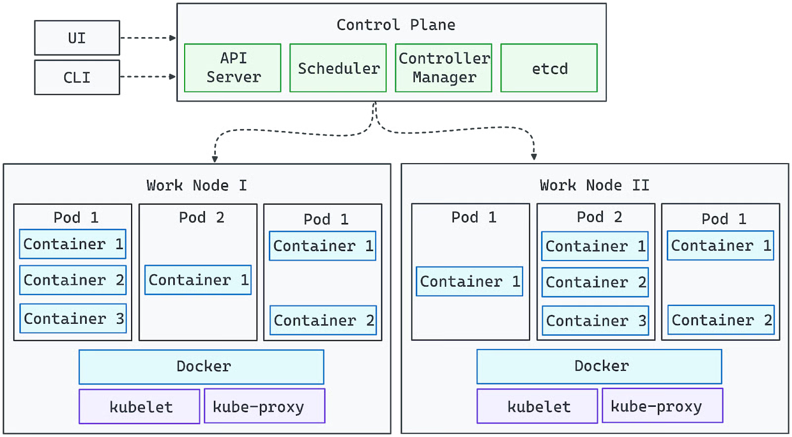

## ☸️ Kubernetes
**Kubernetes** (também chamado de **k8s**) é uma **plataforma open source** para **orquestração de contêineres**. Ele foi originalmente desenvolvido pelo **Google** e hoje é mantido pela **Cloud Native Computing Foundation (CNCF)**.

Ele ajuda a **implantar**, **escalar** e **gerenciar aplicações em contêineres** (como os criados com Docker) de forma automática e eficiente.

<div align="center">
   
</div>

### 🔧 Funcionalidade Principais
 1. **Orquestra contêineres:** decide onde e como os contêineres devem rodar.
 2. **Implantação automática e rollback:** gerencia a implantação e a atualização dos seus aplicativos sem downtime.
 3. **Escalabilidade automática:** aumenta ou reduz a quantidade de réplicas da aplicação conforme a carga.
 4. **Distribuição de carga:** balanceia o tráfego entre os contêineres.
 5. **Autocorreção:** substitui ou reinicia contêineres com problemas automaticamente.
 
### 📦 Conceitos principais

| Conceito       | Descrição                                                                 |
|----------------|---------------------------------------------------------------------------|
| **Pod**        | Unidade mínima no Kubernetes. Pode conter um ou mais contêineres.         |
| **Node** ou **Worker Node**       | Um servidor (físico ou virtual) que roda os Pods.                         |
| **Cluster**    | Conjunto de Nodes gerenciados pelo Kubernetes.                            |
| **Deployment** | Controla a criação e atualização de Pods.                                 |
| **Service**    | Define como os Pods são acessados na rede (internamente ou externamente). |
| **ConfigMap**  | Armazena configurações não sensíveis que podem ser usadas pelos Pods.     |
| **Secret**     | Armazena dados sensíveis como senhas e tokens de forma segura.            |
| **Ingress**    | Gerencia o tráfego HTTP externo para serviços internos.                   |

### 🚀 Benefícios
 - Alta disponibilidade
 - Escalabilidade horizontal
 - Infraestrutura declarativa (infra como código)
 - Portabilidade entre nuvem e on-premises
 - Automatização de tarefas complexas

### 🔌 Onde o Kubernetes é usado?
 - Hospedagem de microserviços
 - Plataformas SaaS
 - CI/CD pipelines
 - Aplicações que exigem alta disponibilidade e escalabilidade
 - Clouds


## 🏗️ Arquitetura
O Kubernetes é um **orquestrador de contêineres de código aberto** que simplifica o complexo processo de gerenciamento de contêineres em escala. Ele abstrai as preocupações com a infraestrutura, permitindo que os desenvolvedores se concentrem na criação de aplicativos em vez de se preocuparem com os servidores subjacentes.

Compreender a arquitetura do Kubernetes é essencial para quem deseja implantar e gerenciar aplicativos escaláveis, resilientes e de nível de produção. 

O diagrama a seguir representa visualmente a arquitetura do Kubernetes:
- Os componentes do plano de controle gerenciam o cluster e garantem que o estado desejado seja mantido.
- Os nós de trabalho executam cargas de trabalho, executando contêineres dentro de pods.
- O API Server atua como ponte entre as interações do usuário (via UI ou CLI) e o cluster.
- Os complementos de rede e armazenamento ampliam os recursos do Kubernetes para ambientes de produção.

<div align="center">
    
</div>

### 🧩 Componentes Principais

#### 🔶 Plano de controle (Control Plane)
O plano de controle do Kubernetes é a camada de gerenciamento central responsável por manter o estado desejado do cluster, agendar cargas de trabalho e lidar com a automação. Ele garante que os aplicativos sejam executados conforme o esperado, monitorando continuamente as condições do cluster e fazendo os ajustes necessários.
<div align="center">
   
</div>

#### 🔶 Servidor de API (kube-apiserver)
O servidor de API é o gateway para o cluster do Kubernetes. Ele processa todas as solicitações de gerenciamento, seja da CLI (kubectl), de painéis da interface do usuário ou de ferramentas de automação. Sem um API Server em execução, o cluster permanece funcional, mas os administradores perdem o controle direto sobre as implementações e configurações.

<div align="center">
   
</div>

**🔹 Subindo Swagger do API-SERVER:**
```bash
# Iniciando minikube
minikube start -n 2 -p multinode

# Baixando json das APIs
kubectl get --raw /openapi/v2 > k8s.json

# Subindo container do swagger
docker run -v $PWD/k8s.json:/app/swagger.json -p 4500:8080 swaggerapi/swagger-ui
```

#### 🔶 Gerenciador de controlador (kube-controller-manager)

O Kubernetes opera no padrão de controlador, em que os controladores monitoram o estado do sistema e tomam ações corretivas. O gerente de controladoria supervisiona esses controladores, garantindo funções essenciais como:

- Dimensionamento de cargas de trabalho com base na demanda.
- Gerenciar nós com falha e reprogramar cargas de trabalho.
- Impor os estados desejados (por exemplo, garantir que uma implantação sempre execute o número especificado de réplicas).

<div align="center">
   
</div>

#### 🔶 Agendador (kube-scheduler)

O Agendador atribui Pods a nós de trabalho, considerando fatores como:

- Disponibilidade de recursos (CPU, memória).
- Regras de afinidade e antiafinidade de nós.
- Distribuição de pods para evitar sobrecarga.

Ele segue um processo de filtragem e pontuação para selecionar o nó ideal para cada novo pod, garantindo a utilização equilibrada dos recursos.

#### 🔶 etcd (armazenamento distribuído de chave-valor)

O etcd funciona como a única fonte de verdade do Kubernetes, armazenando todos os dados do cluster, incluindo:

- O banco de dados do k8s
- Chave/Valor
- Definições de configuração.
- Segredos e credenciais.
- Estados atuais e históricos das cargas de trabalho.

Como o comprometimento do etcd concede controle total sobre o cluster, ele deve ser protegido e receber recursos de hardware adequados para manter o desempenho e a confiabilidade.

<div align="center">
   
</div>

#### 🔶 Gerenciador de controlador de nuvem (cloud-controller-manager)

Para implantações do Kubernetes baseadas na nuvem, o Cloud Controller Manager integra o cluster com os serviços do provedor de nuvem, manipulando-os:

- Provisionamento de balanceadores de carga.
- Alocação de volumes de armazenamento persistente.
- Dimensionar a infraestrutura dinamicamente (por exemplo, adicionar máquinas virtuais como nós)

### 🧩 Componentes do Nó (Worker Node)

Os Worker Nodes são a espinha dorsal computacional de um cluster do Kubernetes, responsáveis por executar cargas de trabalho de aplicativos. Cada nó opera de forma independente e, ao mesmo tempo, mantém comunicação constante com o plano de controle para garantir uma orquestração tranquila.

O Kubernetes programa dinamicamente os pods em nós de trabalho com base na disponibilidade de recursos e nas demandas de carga de trabalho. Os nós podem ser máquinas físicas ou virtuais, e um cluster pronto para produção geralmente consiste em vários nós para permitir o dimensionamento horizontal e a alta disponibilidade. Cada nó de trabalho inclui os seguintes componentes essenciais:

<div align="center">
   
</div>

#### 🔶 O agente do Nó (kubelet)

O Kubelet é o principal agente em nível de nó que gerencia a execução de contêineres. It:

- Comunica-se continuamente com o API Server para receber - instruções.
- Garante que os pods sejam executados conforme definido em suas especificações.
- Extrai imagens de contêineres e inicia os contêineres necessários.
- Monitora a integridade dos contêineres e os reinicia, se necessário.

Sem o Kubelet, o nó seria desconectado do cluster, e as cargas de trabalho programadas não seriam gerenciadas adequadamente.

<div align="center">
   
</div>

#### 🔶 Rede e Balanceamento de Carga (kube-proxy)

O Kube-Proxy é responsável por gerenciar a comunicação de rede entre os serviços executados em nós diferentes.

- Configura as regras de rede para permitir uma comunicação perfeita entre os pods.
- Facilita a descoberta de serviços e o balanceamento de carga para redes entre pods.
- Garante que o tráfego seja roteado corretamente entre os nós e os clientes externos.

Se o Kube-Proxy falhar, os pods no nó afetado poderão ficar inacessíveis, interrompendo o tráfego de rede dentro do cluster.

<div align="center">
   
</div>

#### 🔶 Executando contêineres (container-runtime)

O contêiner runtime é o software que executa aplicativos em contêineres dentro dos pods. O Kubernetes oferece suporte a várias opções de tempo de execução, incluindo:

- containerd (mais comumente usado)
- CRI-O (leve e nativo do Kubernetes)
- Mecanismo Docker (suporte legado via dockershim)

O tempo de execução interage com o sistema operacional para isolar as cargas de trabalho usando tecnologias como cgroups e namespaces, garantindo a utilização eficiente dos recursos.

#### 🔶 Pod

- Menor unidade do kubernetes
- Um ou mais containers
- Containers dentro de um POD podem se comunicar através:
  - Inter-process communication (IPC)
  - Loopback interfafce (localhost)
  - Shared VOlume
- **"one-container-per-pod"** é o modelo mais comum

<div align="center">
   
</div>

- Um ip por POD
   - Atualmente a HPE Labs poossui um plugin para mais de um ip po pod. Mas outras iniciativas no passado não tiveram sucesso
- Sidecar: Um container para executar uma tarefa auxiliar

<div align="center">
   
</div>

#### 🔶 Services

Um Service é um objeto que expõe e estabiliza o acesso a um conjunto de Pods, funcionando como uma camada de rede fixa, mesmo quando os Pods sobem ou caem.

##### 📌 Em resumo, um Service serve para:

- Dar um IP fixo e um DNS estável para acessar Pods.
- Balancear carga automaticamente entre múltiplos Pods.
- Encapsular a lógica de descoberta de Pods, usando labels e selectors.

##### 🧩 Tipos principais de Service:

- **ClusterIP (padrão) →** acessível apenas dentro do cluster.
- **NodePort →** abre uma porta em todos os nodes para acesso externo.
- **LoadBalancer →** cria um load balancer externo (em nuvens públicas).
- **ExternalName →** mapeia para um DNS externo.

<div align="center">
   
</div>

#### 🔶 Como os nós de trabalho interagem com o plano de controle

- Os nós entram no cluster usando um token emitido pelo plano de controle.
- Depois que um nó é registrado, o agendador atribui cargas de trabalho com base nos recursos disponíveis.
- O plano de controle monitora continuamente a integridade do nó e pode reprogramar as cargas de trabalho se um nó ficar insalubre ou sobrecarregado.

Ao combinar o Kubelet, o Kube-Proxy e um tempo de execução de contêiner, os nós de trabalho formam uma camada de execução dimensionável e resiliente que alimenta os aplicativos Kubernetes.

## 🌐 Network
A rede no Kubernetes (K8s) segue alguns princípios fundamentais para garantir que todos os componentes, Pods, Nodes, Services possam se comunicar de forma previsível, independente de onde estão no cluster.

<div align="center">
   
</div>

A arquitetura de rede no Kubernetes é baseada em **quatro garantias principais**:

### 📌 1. Cada Pod recebe um IP próprio

- Cada Pod ganha seu próprio endereço IP único, que não é compartilhado com outros Pods.
- Isso permite que os Pods se comuniquem de forma direta, usando portas simples, sem NAT dentro do cluster.
- Os containers dentro do mesmo Pod compartilham o mesmo namespace de rede (mesmo IP, mesmas portas).

### 📌 2. Comunicação Pod → Pod deve ser livre (sem NAT)

Kubernetes define que:

- Todos os Pods devem poder se comunicar entre si independentemente do Node onde estão.
- Essa comunicação deve ocorrer sem NAT (Network Address Translation).

É por isso que o Kubernetes exige um CNI plugin (Container Network Interface), como:

- Calico
- Flannel
- Cilium
- Weave Net
- Amazon VPC CNI
- Azure CNI
- GKE Dataplane V2

Esses plugins são responsáveis por:

- Criar rotas entre Pods
- Atribuir IPs
- Configurar iptables/ebpf
- Implementar políticas de rede (network policies)

### 📌 3. Comunicação Pod → Service

Um Service representa um endpoint estável (IP fixo) que distribui tráfego para Pods.

Existem tipos diferentes de serviços:

#### 🟦 ClusterIP

- Padrão
- Acessível somente dentro do cluster

#### 🟧 NodePort

- Abre uma porta em todos os nodes
- Encaminha tráfego externo para o Service

#### 🟥 LoadBalancer

- Integrado com a nuvem (AWS, Azure, GCP etc.)
- Cria um Load Balancer externo

**Como funciona internamente?**
O kube-proxy cria regras usando:

- iptables, ou
- ipvs

Essas regras equilibram o tráfego entre os Pods selecionados.

### 📌 4. Comunicação com o mundo externo

Há dois caminhos principais:

#### 🔹 Entrada no cluster (Ingress)

Ingress + Ingress Controller (NGINX, Traefik, Istio, etc.)
→ Recebe tráfego HTTP/HTTPS e roteia para Services.

#### 🔹 Saída do cluster (Egress)

Normalmente via:

- NAT do Node
- Regras de Egress
- Gateways (Istio, Cilium eBPF etc.)

### 🧩 Componentes importantes da rede no K8s

#### ✔ CNI Plugin (obrigatório)
Responsável pelo plano de dados da rede:

- Configura interfaces & rotas
- Gerencia endereços IP
- Implementa network policies

Sem um CNI, Pods não sobem.

<div align="center">
   
</div>

#### ✔ kube-proxy

Implementa o serviço de rede:

- Regras de load balancing
- Regras de Service → Pod
- Usa iptables ou IPVS

<div align="center">
   
</div>

#### ✔ CoreDNS
- **Resolve nomes internos como:** myservice.default.svc.cluster.local
- Traduz para o ClusterIP do Service.

#### 📝 Em poucas palavras:

- Cada Pod tem seu próprio IP.
- Plugins CNI criam a malha de rede.
- kube-proxy controla o roteamento para Services.
- Ingress controla entrada.
- NAT ocorre apenas na borda (entrada/saída), não entre Pods.

## 🌩️ Principais provedores e suas implementações Kubernetes
| Provedor                        | Nome do Serviço Kubernetes                     | Sigla     |
| ------------------------------- | ---------------------------------------------- | --------- |
| **Amazon Web Services (AWS)**   | Elastic Kubernetes Service                     | **EKS**   |
| **Microsoft Azure**             | Azure Kubernetes Service                       | **AKS**   |
| **Google Cloud Platform (GCP)** | Google Kubernetes Engine                       | **GKE**   |
| **IBM Cloud**                   | IBM Kubernetes Service                         | **IKS**   |
| **Oracle Cloud**                | Oracle Container Engine for Kubernetes         | **OKE**   |
| **Alibaba Cloud**               | Alibaba Cloud Container Service for Kubernetes | **ACK**   |
| **DigitalOcean**                | DigitalOcean Kubernetes                        | **DOKS**  |
| **Linode (Akamai Cloud)**       | Linode Kubernetes Engine                       | **LKE**   |

## ▶️ Comandos Essenciais

```bash
# Iniciar minikube
minikube start -n 2 -p multinode

# Buscar nodes
kubectl get nodes

# Buscar pods
kubectl get pods -A

# Recursos da API-Server
kubectl api-resources

# Parar minikube
minikube stop -p multinode
```
