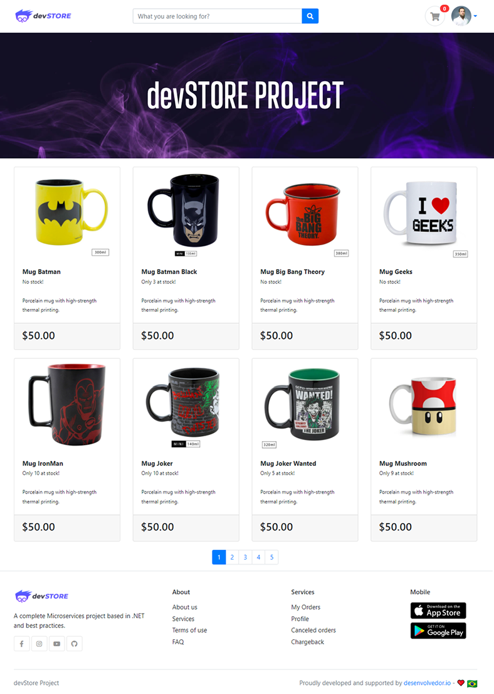
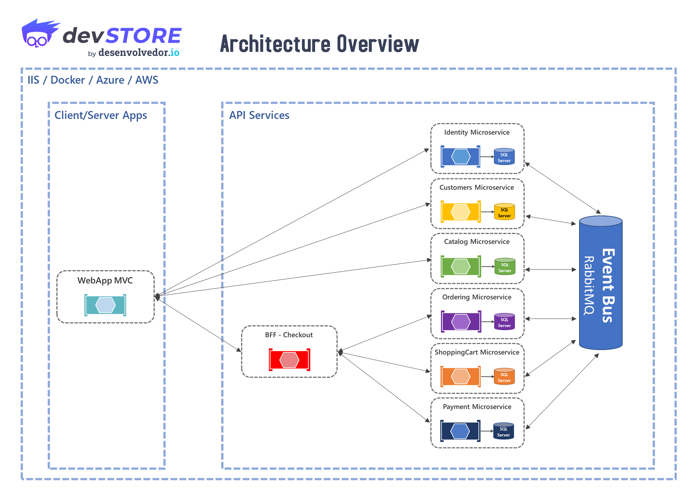

<div align="center">
   
</div>

O **DevStore** é um **e-commerce** baseada em **microsserviços**, construída com **ASP.NET 9**

<div align="center">
   
</div>

## 🧩 Arquitetura

Arquitetura completa que implementa os principais padrões, como:

- Hexagonal Architecture
- Clean Code
- Clean Architecture
- DDD - Domain Driven Design (Layers and Domain Model Pattern)
- Domain Events
- Domain Notification
- Domain Validations
- CQRS (Immediate Consistency)
- Retry Pattern
- Circuit Breaker
- Unit of Work
- Repository
- Specification Pattern
- API Gateway / BFF

<div align="center">
   
</div>

## 🚀 Como executar o projeto

**Pré-requisitos:**

- Antes de começar, você vai precisar ter instalado em sua máquina o **minikube** e **k9s (opcional)**. 

- **Minikube** é uma ferramenta de código aberto que permite executar um clusters Kubernetes localmente.

- **K9s** é uma interface de terminal (TUI) de código aberto projetada para navegar, observar e gerenciar clusters Kubernetes com eficiência. Ele facilita o monitoramento em tempo real de recursos, simplifica a depuração (logs, shell) e acelera tarefas diárias, substituindo comandos longos do kubectl.

```bash
######################
# Iniciando Minikube #
######################

# Iniciando
minikube start -n 2 -p multinode

# Habilitar o addon de ingress no minikube (perfil multinode)
minikube addons enable ingress -p multinode

# Parando
minikube stop -p multinode

######################
# Configurando HTTPS #
######################

# Configurando gerenciador do certificado ssl
kubectl apply -f ./manager-ssl/manager-ssl.yaml -n devstore

###############################
# Configurando infraestrutura #
###############################

# RabbitMQ
kubectl apply -f ./rabbitmq -R 

# SQLServer
kubectl apply -f ./sqlserver -R 

# PostgreSQL 
helm repo add cetic https://cetic.github.io/helm-charts

helm install postgresql cetic/postgresql -n infra

##############################
# Criando Connection Secrets #
##############################

# identity-connection-secret
kubectl apply -f ./api-identity/identity-connection-secret.yaml -n devstore

# catalog-connection-secret
kubectl apply -f ./api-catalog/catalog-connection-secret.yaml -n devstore

# customer-connection-secret
kubectl apply -f ./api-customer/customer-connection-secret.yaml -n devstore

# cart-connection-secret
kubectl apply -f ./api-cart/cart-connection-secret.yaml -n devstore

# billing-connection-secret
kubectl apply -f ./api-billing/billing-connection-secret.yaml -n devstore

# order-connection-secret
kubectl apply -f ./api-orders/order-connection-secret.yaml -n devstore

# status-connection-secret
kubectl apply -f ./web-status/status-connection-secret.yaml -n devstore

########################################
# Criando Microsserviços de E-Commerce #
########################################

# api-identity
helm upgrade --install api-identity -f api-common.yaml -f ./api-identity/values.yaml ./api-template -n devstore

# api-catalog
helm upgrade --install api-catalog -f api-common.yaml -f ./api-catalog/values.yaml ./api-template -n devstore

# api-customer
helm upgrade --install api-customer -f api-common.yaml -f ./api-customer/values.yaml ./api-template -n devstore

# api-cart
helm upgrade --install api-cart -f api-common.yaml -f ./api-cart/values.yaml ./api-template -n devstore

# api-billing
helm upgrade --install api-billing -f api-common.yaml -f ./api-billing/values.yaml ./api-template -n devstore

# api-orders
helm upgrade --install api-orders -f api-common.yaml -f ./api-orders/values.yaml ./api-template -n devstore

# api-bff-checkout
helm upgrade --install api-bff-checkout -f api-common.yaml -f ./api-bff-checkout/values.yaml ./api-template -n devstore

##########################
# Criando Aplicações WEB #
##########################

# Adicionar entrada no arquivo hosts domínios

# devstore.info
sudo nano /etc/hosts
192.168.58.2 devstore.info

# status.devstore.info
sudo nano /etc/hosts
192.168.58.2 status.devstore.info

# Criando Aplicações WEB
helm upgrade --install web-mvc -f ./web-mvc/values.yaml ./api-template -n devstore

# web-status
helm upgrade --install web-status -f api-common.yaml -f ./web-status/values.yaml ./api-template -n devstore

# Configurar o túnel do Minikube para expor aplicações web 
minikube tunnel -p multinode

# URLs
# http://devstore.info
# http://status.devstore.info

##########################
# Testando Conectividade #
##########################

# Testar a conectividade de rede
kubectl run test-network --image=nicolaka/netshoot -i --tty --rm

# api-identity
curl -k https://api-identity.devstore/healthz
curl -k https://api-identity.devstore/healthz-infra

# api-catalog
curl -k https://api-catalog.devstore/healthz
curl -k https://api-catalog.devstore/healthz-infra
curl -k https://api-catalog.devstore/catalog/products

# api-customer
curl -k https://api-customer.devstore/healthz
curl -k https://api-customer.devstore/healthz-infra

# api-cart
curl -k https://api-cart.devstore/healthz
curl -k https://api-cart.devstore/healthz-infra

# api-billing
curl -k https://api-billing.devstore/healthz
curl -k https://api-billing.devstore/healthz-infra

# api-orders
curl -k https://api-orders.devstore/healthz
curl -k https://api-orders.devstore/healthz-infra

# api-bff-checkout
curl -k https://api-bff-checkout.devstore/healthz

# web-mvc
curl -k https://web-mvc.devstore/healthz

# web-status
curl -k https://web-status.devstore/healthz
curl -k https://web-status.devstore/healthz-infra
```